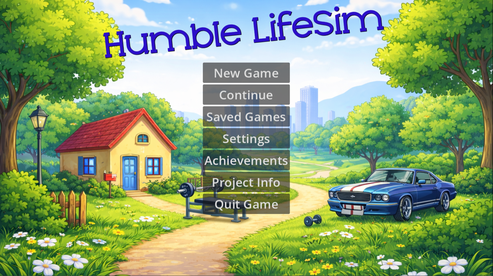
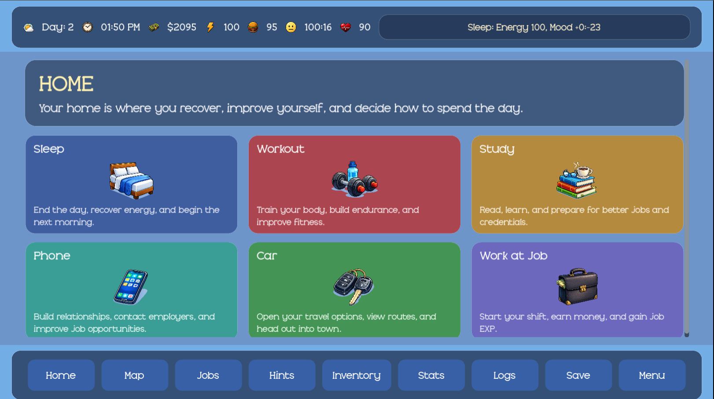
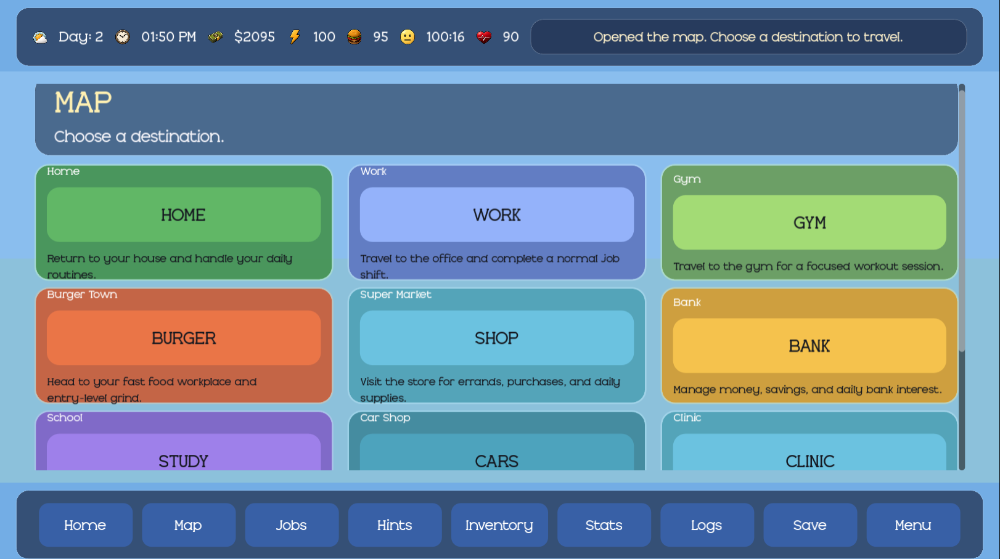
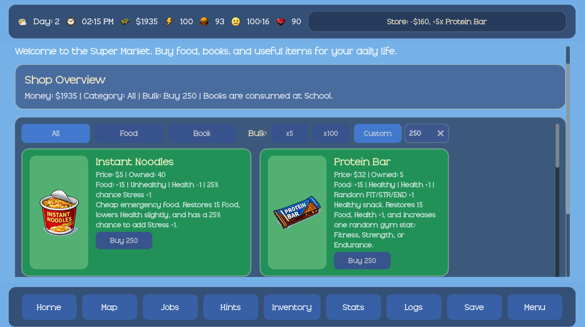
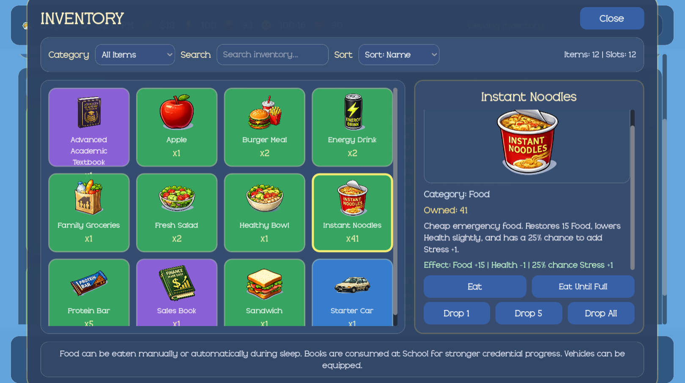
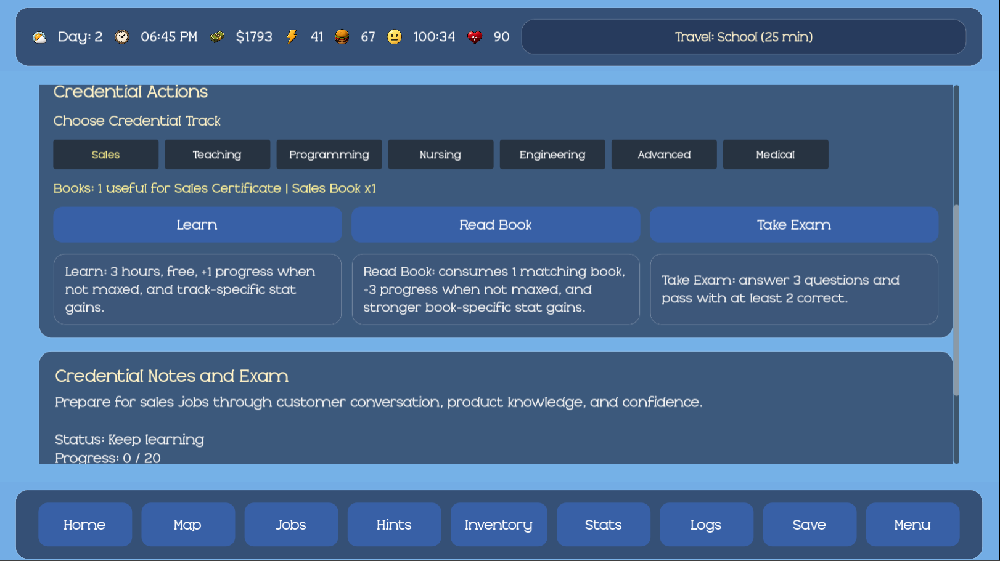
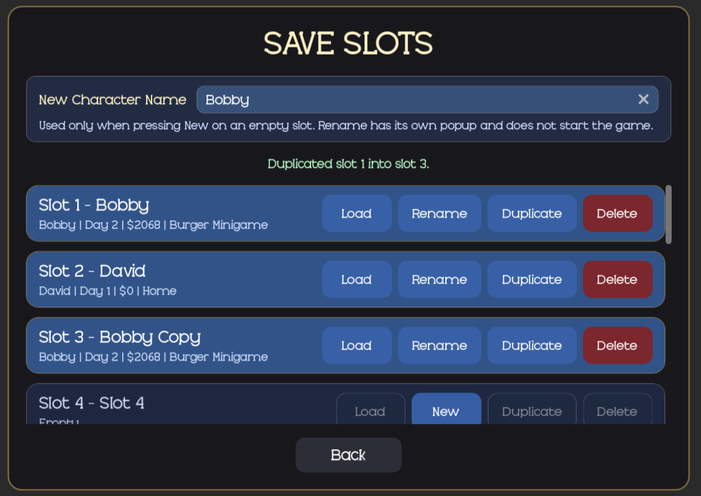
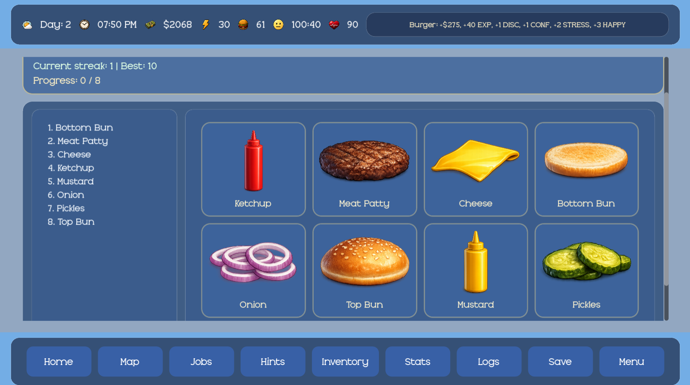
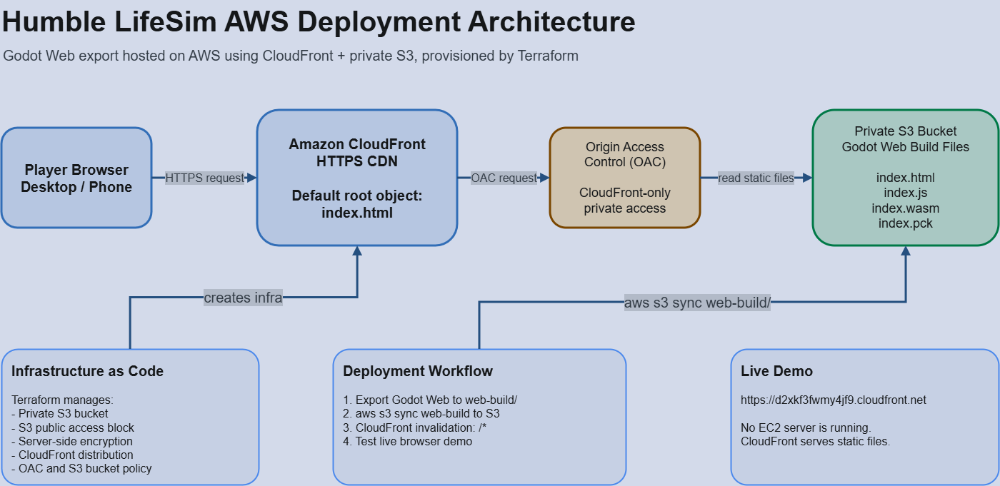

# Humble LifeSim

Humble LifeSim is a 2D life-simulation and management game built in Godot with GDScript. The player manages daily life choices such as eating, sleeping, studying, working, traveling, shopping, saving progress, and improving long-term stats.

This started as my CSC492 Senior Design project and is now being expanded into a long-term portfolio project. The current version is a browser-playable AWS-hosted demo.

## Live demo

Play Humble LifeSim in browser:

https://d2xkf3fwmy4jf9.cloudfront.net

## Project status

AWS-hosted portfolio demo.

Current focus:

- Stable Godot Web export
- Clean public GitHub repo
- AWS static hosting with Amazon S3 and CloudFront
- Terraform-managed infrastructure
- Clear documentation for recruiters and technical reviewers

## Screenshots

### Main menu



### Home and HUD



### Map and travel



### Store with bulk buying



### Inventory



### School and credentials



### Save slots



### Burger Town minigame



## AWS deployment architecture

Humble LifeSim is exported from Godot Web and hosted on AWS using a private S3 bucket behind CloudFront. The infrastructure is provisioned with Terraform.



Deployment flow:

```text
Player Browser
  -> Amazon CloudFront HTTPS CDN
  -> Origin Access Control
  -> Private Amazon S3 bucket
  -> Godot Web export files